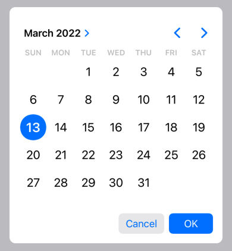

# OverlayDatePicker



## Usage

```swift
.overlay {
    OverlayDatePicker(isPresented: $isPresented, date: some Date) { date in
        // Use the selected date e.g. Update ViewModel
    }
}
```

```swift
.overlay {
    OverlayDateRangePicker(isPresented: $selectDateRange, range: some CloseRange<Date>) { range in
        // Use the selected range e.g. Update ViewModel
    }
}
```

## Install

### SwiftPM

```
https://github.com/divadretlaw/OverlayDatePicker.git
```

## License

See [LICENSE](LICENSE)

Copyright © 2022 David Walter (www.davidwalter.at)
